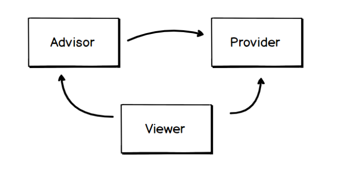
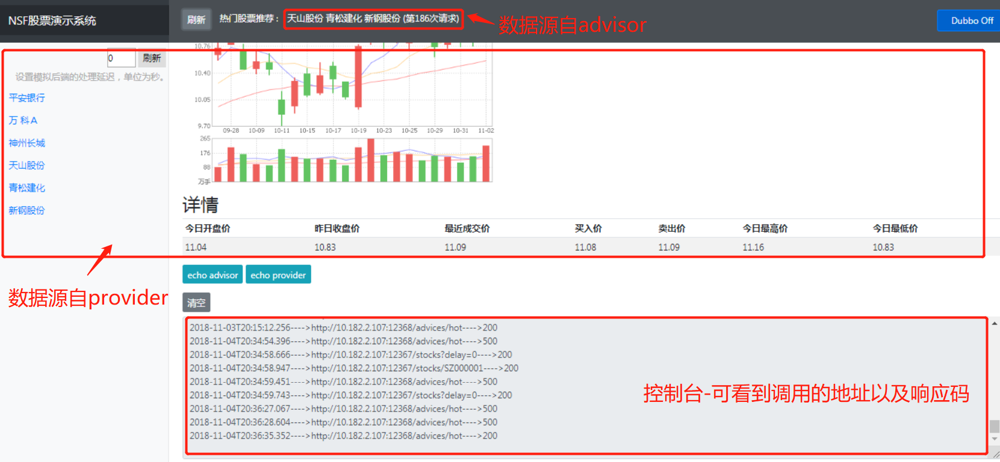

为模拟微服务架构，展现nsf微服务治理框架对微服务的治理能力，设计了一款股票应用。 

## 架构

## 设计说明
nsf-sample由三个微服务组成，分别为viewer、advisor、provider。

### provider
提供股票的元数据，包括名字、买入价、收盘价、K线图等等。

### advisor
从provider接收股票元数据，通过推荐系统计算出推荐的股票。

### viewer
提供股票信息展示界面，调用advisor展示推荐股票信息，调用provider展示部分股票的基本信息。

如要调整viewer访问advisor和provider的地址，可在启动参数中加上-Dstock_provider_url和-Dstock_advisor_url进行覆盖。
例如：stock_provider_url=http://localhost:9001。

advisor访问provider同理，使用-Dstock_provider_url覆盖provider地址。

viewer展示界面如下图所示：
